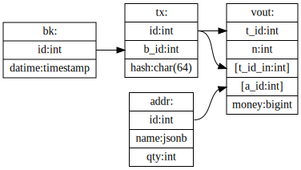

# DBS
DataBase Server installation (PostgreSQL).

Prerequisitions:

- distro: Fedora 33
- [DBA](https://en.wikipedia.org/wiki/Database_administrator) password: _$DBAPASSWORD_
- DB name: _$BTCDB_
- DB user: _$BTCUSER_
- DB password: _$BTCPASS_
- DB location: /mnt/shares/_dbsname_/

## 1. Install (client and server)

```bash
sudo dnf install postgresql-server
```

_Note: `postgresql` (client) installing by dependencies_.

## 2. Config server

- Init data:

```bash
sudo -u postgres postgresql-setup --initdb
```

- /var/lib/pgsql/data/pg_hba.conf:

```diff
 # "local" is for Unix domain socket connections only
-local all all                peer
+local all all                trust
 # IPv4 local connections:
-host  all all 127.0.0.1/32   ident
+host  all all 127.0.0.1/32   md5
+# IPv4 LAN connections:
+host  all all 192.168.0.0/24 md5
+# or IPv4 LAN/WAN connections:
+# host  all all 0.0.0.0/0 md5
 # IPv6 local connections:
-host  all all ::1/128        ident
```

- /var/lib/data/postresql.conf:

```diff
-#listen_addresses = 'localhost'
+listen_addresses = '*'
-shared_buffers = 128MB
+shared_buffers = 8192MB #(¼ RAM)
```


- Move data to external storage (option):

```bash
sudo mkdir /mnt/shares/pgsql
sudo chown postgres:postgres /mnt/shares/pgsql
sudo mv /var/lib/pgsql/data /mnt/shares/pgsql/
sudo ln -s /mnt/shares/pgsql/data /var/lib/pgsql/data
```

## 3. Start server

```bash
sudo systemctl enable --now postgresql
```

### _check:_

```bash
telnet localhost 5432
```

## 4. Create user and DB

```bash
sudo -u postgres createuser -U postgres -w $BTCUSER -P $BTCPASS
sudo -u postgres createdb -O "$BTCUSER" $BTCDB
```

or (long version):

```bash
psql -U postgres
CREATE USER $BTCUSER;
ALTER USER $BTCUSER WITH ENCRYPTED PASSWORD '$BTCPASS';
CREATE DATABASE $BTCDB;
GRANT ALL PRIVILEGES ON DATABASE $BTCDB TO $BTCUSER;
ALTER DATABASE $BTCDB OWNER TO $BTCUSER;
\q
```

### Read-only user:

```sql
CREATE USER $BTCREADER WITH PASSWORD '$BTCPASS';
GRANT CONNECT ON DATABASE $BTCDB TO $BTCREADER;
GRANT USAGE ON SCHEMA public TO $BTCREADER;
GRANT SELECT ON ALL TABLES IN SCHEMA public TO $BTCREADER;
ALTER DEFAULT PRIVILEGES IN SCHEMA public GRANT SELECT ON TABLES TO $BTCREADER;
```

## 5. Config client

~/.pgpass:

```localhost:5432:$BTCDB:$BTCUSER:$BTCPASS```

#### _check:_

```bash
pg_isready -d $BTCDB -U $BTCUSER
psql $BTCDB $BTCUSER
\q
```

## x. Misc

- Check databases and users:

   ```bash
   psql -U postgres -c "SELECT * FROM pg_user; SELECT * FROM pg_database;"
   ```
- `psql -h <socket_dir=/tmp/>`
- `VACUUM ANALYZE [blocks,transactions,addresses,data];`
- `shared_buffer = 0.25 RAM`
- `effective_cache_size = 0.5..0.75 RAM`
- `work_mem (in 1MB)`
- RTFM:
  [1](https://linux-notes.org/ustanovka-postgresql-centos-red-hat-fedora/)
  [2](https://www.digitalocean.com/community/tutorials/how-to-install-and-use-postgresql-on-ubuntu-18-04-ru)
  [3](http://r00ssyp.blogspot.com/2017/03/postgresql-9.html)

- ~~Move PostgreSQL data into other location:~~
  - /etc/passwd: /var/lib/pgdsql => *newdir*
  - *newdir*/.bash_profile : PGDATA=*newdir*

----


_([source](DB.dot))_
