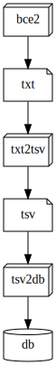

# ImpEx

Import/Export data from bcepy/bce2 to SQL DB.

Main goal is to export into interim tsv and import into DB.  
Import into DB (`tsv2db.sh`) is enought trivial and just uses SQL `COPY` instruction.  
Aim of `txt2tsv.sh` is to prepare data for this `COPY`.  
It is possible as split export and import separately as use both of utils together via pipe.

Let's work with source data as `txt/250.txt.gz` and interim tsv in `tsv/`

## 1. Export

Export from src into interim .tsv files is doing with`txt2tsv.sh`utility (use `./txt2tsv.sh -h` for help).
It accepts target table character and source data file as argument.
Target table is: a=addr, b=bk, t=tx, v=vout.
Source must be gzipped.  
Optional arhgument `-t` (temporary space) is very important during generating 'v' output. With big source data utillty can eat all of RAM and then require *fast* and *huge* temporary storage (starting from half of *uncompressed* source).

Bulk export into files can be:

```bash
for i in a b t v
do
  ./txt2tsv.sh $i txt/250.txt.gz | pigz -c > tsv/$i.tsv.gz
done
```

## 2. Import

Import primary data into DB is doing with `./tsv2db.sh` that accepts target table as argument and imported data from stdin.

_(Warning: be sure that all tables are empty (`bcedb.sh trunc ...`) and have no indexes (`bcedb.sh unidx ...`))_

Bulk import sample:

```bash
for i in a b t v
do
  unpigz -c tsv/$i.tsv.gz | ./tsv2db.sh $i
done
```

_Note: or all togeter (export+import):_
```bash
for i in a b t v
do
  ./txt2tsv.sh $i txt/250.txt.gz | ./tsv2db.sh $i
done
```

After this you **must** index all of these 4 tables (`bcedb.sh idx ...`)

## 3. TXO

_Warning: be sure that you **indexed** all 4 previous tables and **droped txo** table before next steps._

After loading primary data (bk/tx/tx/vout/addr) you must [re]**create** working table - txo. It is summary of vout in simplified form. Vouts that are stored: a) money > 0, b) single address (&rArr; multisigs and addressless not included):  
`bcedb.sh xload x`

And last step - index it:  
`bcedb.sh idx x`  

~~Now you can *vacuum* all tables before quirying.~~

----


_([source](ImpEx.dot))_
