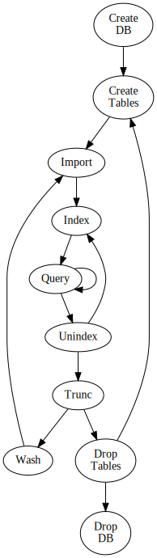

# WorkFlow

Typical workflow to use bcerq utility set:

1. Config DBS

   install and configure PostgreSQL server, client, database and DB user manually ([RTFM](DBS.md)).

1. Prepare `~/.bcerq.ini`

   create `~/.bcerq.ini` similar to [sample](bcerq.ini) (manually).

1. Create DB scheme

   create DB tables using `bcedb.sh` ([RTFM](DB.md))
   *(e.g. `./bcedb.sh create z`)*

1. Load source data

   import data using `txt2tsv.sh` and `tsv2db.sh` ([RTFM](ImpEx.md));
   then index and valuum DB using `bcedb.sh`

1. Load [TXO](TXO.md)

1. Check (optional)

   It is possible to make tests and benchmarks to estimate DB usability using [`test_db.sh`](../test_db.sh) ([RTFM](Test_DB.md))

1. Queries

   main job using [`bcerq.py`](../bcerq.py) ([RTFM](BCERQ.md))

---

_([source](WorkFlow.dot))_
